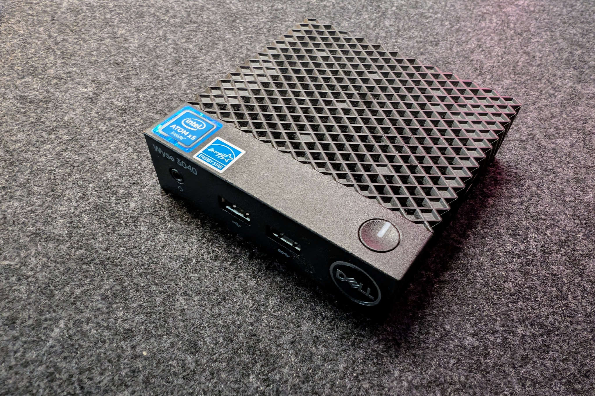
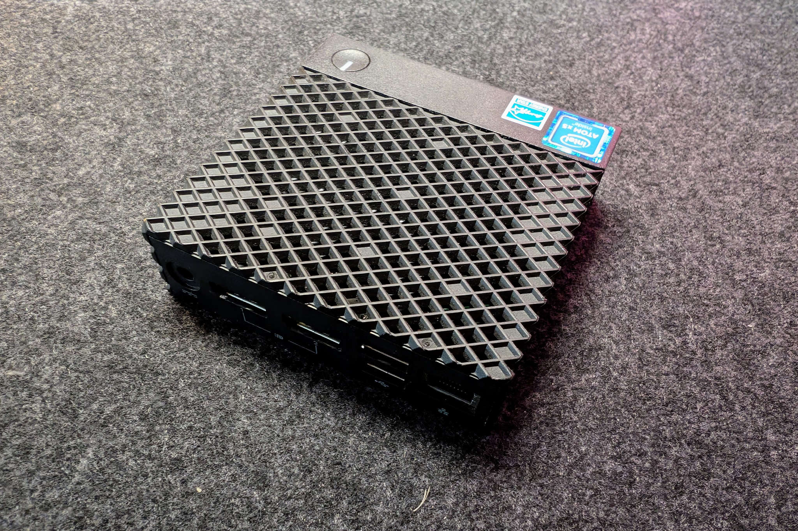
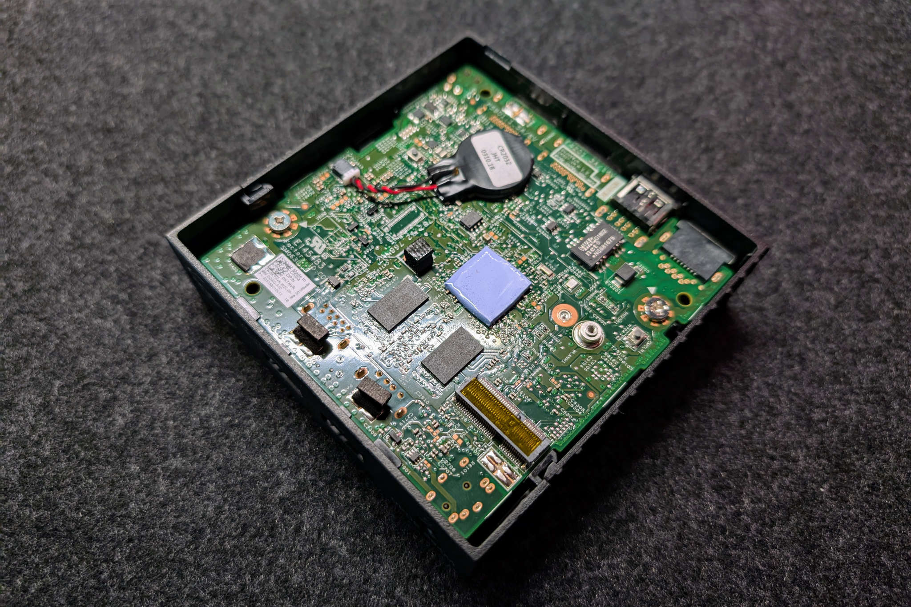

# Dell Wyse 3040 Thin Client
The Dell Wyse 3040 Thin Client is a compact and good available Mini-PC /
Thinclient, valued for its small size and energy efficiency. It has gained
attention as a substitute for single-board computers (SBCs) like the Raspberry
Pi, also in projects like 3D printers with Klipper/Mainsail as Firmware/GUI.

However, the Dell Wyse 3040 is not without any limitation. One of the main
drawbacks is the extremely limited internal storage (8GB/16GB eMMC), which can
restrict its use in many projects. Fortunately, this issue can be overcome with
a simple workaround.

## Specifications
- **Processor**: Intel Atom x5-Z8350 (4 cores, 1.44 GHz)
- **RAM**: 2GB DDR3L
- **Storage**: 8GB or 16GB eMMC
- **Connectivity**: 2x DisplayPort, 3x USB 2.0, 1x USB 3.0, 1x RJ45
- **Networking**: 1x Gigabit Ethernet, Wi-Fi (optional)
- **Power**: 5V/3A via barrel jack
- **Dimensions**: 101.6 x 101.6 x 27.9 mm

## Images
<figure markdown="span">
    
    <figcaption>Dell Wyse 3040 Thin Client - Front</figcaption>
</figure>

<figure markdown="span">
    
    <figcaption>Dell Wyse 3040 Thin Client - Back</figcaption>
</figure>

<figure markdown="span">
    
    <figcaption>Dell Wyse 3040 Thin Client - Bottom plate open</figcaption>
</figure>