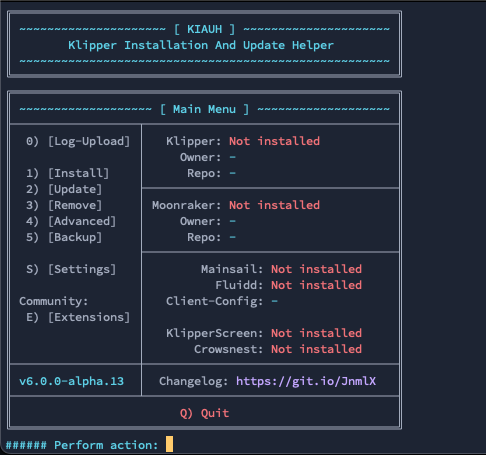
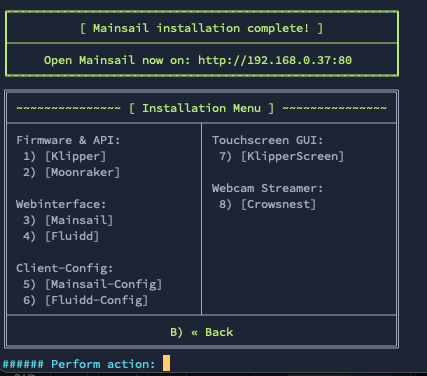
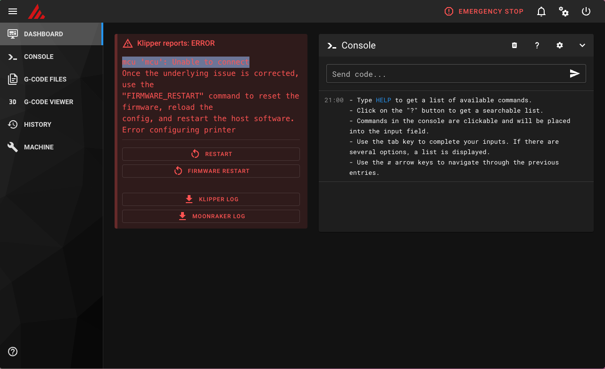

# Install Klipper, Moonraker and Mainsail on the Dell Wyse 3040
Setting up Klipper, Moonraker, and Mainsail on the Dell Wyse 3040 Thin Client is
a straightforward process, thanks to the use of KIAUH (Klipper Installation And
Update Helper). Unlike some other devices, there is no pre-built image available
for the Wyse 3040, but KIAUH simplifies the installation and configuration steps
significantly.  
  
This guide will walk you through the process of preparing your Wyse 3040,
installing the necessary components, and setting up your 3D printer control
environment. By following these steps, you can transform this compact thin
client into a powerful hub for your 3D printing projects.

## Prerequisites
1. Before you start, ensure you have the following packages installed on your
   system:
   ```bash
   sudo apt update
   sudo apt upgrade
   sudo apt install git -y
   ```
2. Clone the KIAUH repository to your home directory:
   ```bash
   cd ~ && git clone https://github.com/dw-0/kiauh.git
   ```

3. Open KIAUH by running the following command:
   ```bash
   ./kiauh/kiauh.sh
   ```
   
4. Select KIAUH v6 (Currently this version is in the testing phase, but I think
   it will be stable enough for our purposes). To use v6 of KIAUH, enter 3 and
   press Enter. (This step will be dropped once KIAUH v6 is stable and merged)

5. Now you will see the KIAUH main menu.
   

## Installing Klipper
1. Install Klipper by selecting option 1 from the KIAUH main menu to open the
   installation submenu. Then, select option 1 to install Klipper.
2. First Question is about the Klipper instances, just press Enter to use the
   default value (1 instance).
3. Next question is about the Klipper configuration, press Enter to use the
   default value (default configuration).
4. Now KIAUH will install Klipper and its dependencies. This process may take
   some time, so be patient. (You may enter your password when prompted)
5. Short before the installation is finished, you will be asked if your user
   should be added to the `dialout` group. Press Enter to confirm.
6. After the installation is complete, you will see the Installation submenu
   again.

## Installing Moonraker
1. After Klipper is installed, you should be already in the Installation 
   submenu. If not, open it by selecting option 1 from the KIAUH main menu.
2. Select option 2 to install Moonraker.
3. First question is, if it should create an example configuration. Press Enter
   to use the default value (Yes).
4. Now KIAUH will install Moonraker and its dependencies. This process may take
   some time, so be patient. (You may enter your password when prompted)
5. After the installation is complete, you will see the Installation submenu
   again.

## Installing Mainsail
1. After Moonraker is installed, you should be already in the Installation 
   submenu. If not, open it by selecting option 1 from the KIAUH main menu.
2. Select option 3 to install Mainsail.
3. First question is, if it should also download the Mainsail-Config. Press
   Enter to use the default value (Yes) to download the Mainsail-Config.
4. Now, KIAUH will ask you for the Port, where Mainsail should run. Press Enter
   to use the default value (80).
5. Now KIAUH will install Mainsail and its dependencies. This process may take
   some time, so be patient. (You may enter your password when prompted)
6. After the installation is complete, you will see the Installation submenu
   again. With this short info block above the menu:  
   
7. Open your browser and enter the URL from the info block to access Mainsail.
   (In this case, it would be `http://192.168.0.37:80`)
8. You should see the Mainsail Dashboard, with the error message `mcu 'mcu':
   Unable to connect`. This is expected, as we have not yet configured Klipper.
   
9. Congratulations! You have successfully installed Klipper, Moonraker, and
   Mainsail on your Dell Wyse 3040 Thin Client. The next step is to configure
   Klipper to connect to your 3D printer.