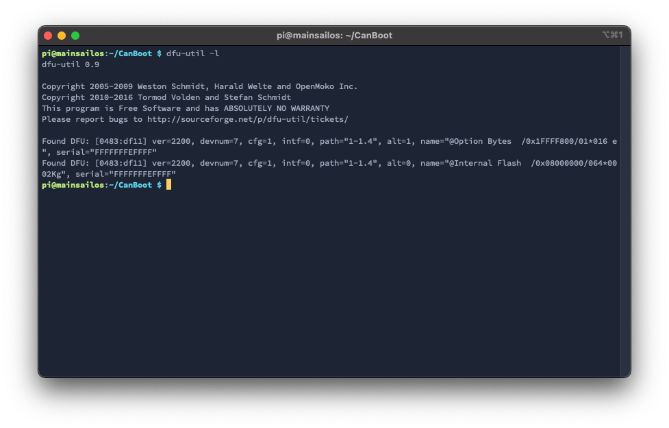

# CanBoot bootloader (optional)

[Canboot](https://github.com/Arksine/CanBoot){:target="_blank"} is a bootloader for MCUs to be able to update/flash them via CANBUS.  
With CanBoot there is no physical intervention (e.g. pressing the boot button) required to flash/update firmware to the
MCUs.

!!! success "This guide is tested with the following boards:"

    - Mellow Fly-SHT 42 v1

    This guide was verified on a Pi running [MainsailOS](https://github.com/mainsail-crew/MainsailOS){:target="_blank"}

## Download CanBoot
Clone the CanBoot repository:
``` bash
cd ~
git clone https://github.com/Arksine/CanBoot
```
To add CanBoot to your moonraker update manager, add this section to your config (optional):
``` yaml title="moonraker.conf"
[update_manager canboot]
type: git_repo
origin: https://github.com/Arksine/CanBoot.git
path: ~/CanBoot
is_system_service: False
```

## Configure CanBoot
Open the config dialog with the following commands:
``` bash
cd ~/CanBoot
make menuconfig
```
and use following config settings:

- Micro-controller Architecture: **STMicroelectronics STM32**
- Processor model: **STM32F072**
- Build CanBoot deployment application: **Do not build**
- Clock Reference: **8 MHz crystal**
- Communication interface: **CAN bus (on PB8/PB9)**
- Application start offset: **8KiB offset**
- CAN bus speed: **500000**
- Support bootloader entry on rapid double click of reset button: **check** *(optional but recommend)*
- Enable Status LED: **check**
- Status LED GPIO Pin: **!PC13**

this should then look like this:
<figure markdown>
  
  <figcaption>CanBoot config for Mellow FLY-SHT devices</figcaption>
</figure>
use `q` for exit and `y` for save these settings.

These lines just clear the cache and compile the CanBoot bootloader:
``` bash
make clean
make
```

## Flash CanBoot

First, you have to put the board into DFU mode. To do this, plug in a jumper to the following pins and then plug in the
usb cable:


With the command `dfu-util -l`, you can check if the board is in DFU mode. If dfu-util can discover a board in DFU mode
it should then look like this:

If this is not the case, repeat the boot/restart process and test it again.

If your board is in DFU mode, you can flash CanBoot with the following command:
``` bash
dfu-util -a 0 -D ~/CanBoot/out/canboot.bin -s 0x08000000:mass-erase:force
```

Now remove the jumper and unplug & plug-in the USB cable again. If the board is in CanBoot mode, the LED should blink.