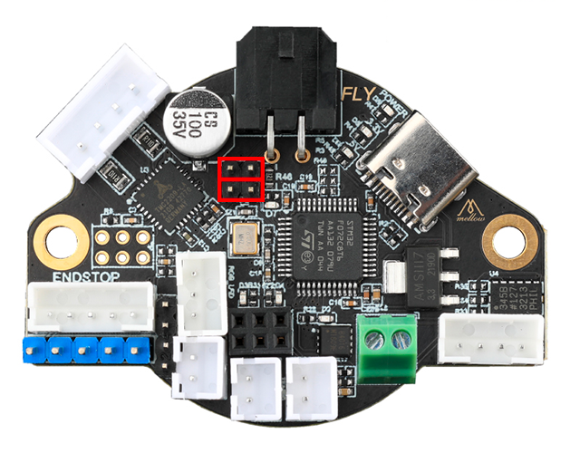

# Mellow FLY-SHT 36/42

- [official Repository](https://github.com/Mellow-3D/Klipper-CAN-Toolboards){:target="_blank"}
- [Schematic](https://github.com/Mellow-3D/Klipper-CAN-Toolboards/blob/main/Schematic_36-42%20Klipper%20CAN%20Boards_2022-04-14.pdf){:target="_blank"}

## Features

- CAN bus connection for stable data transmission over long distances
- 24 volt max input
- 5 amp mosfet for heater control
- Onboard TMC2209 driver for the extruder
- Onboard ADXL345 accelerometer to measure resonance for input shaper.
- Replaceble fan MOS that supports 2 controllable fans.
- RGB Led control
- Peripheral interface: USB1, CAN1, FAN2, RGB1, Servo1, Probe1, EndStop3, PT100 4 line1(optional), Thermal1, Heater1

## Fly-SHT 36 v1 Size

## Fly-SHT 36 v1 Pinout

## Fly-SHT 36 v1 Termination
This board need two jumpers to termination the CAN bus.

## Fly-SHT 42 v1 Size

## Fly-SHT 42 v1 Pinout

## Fly-SHT 42 v1 Termination
This board need two jumpers to termination the CAN bus.

