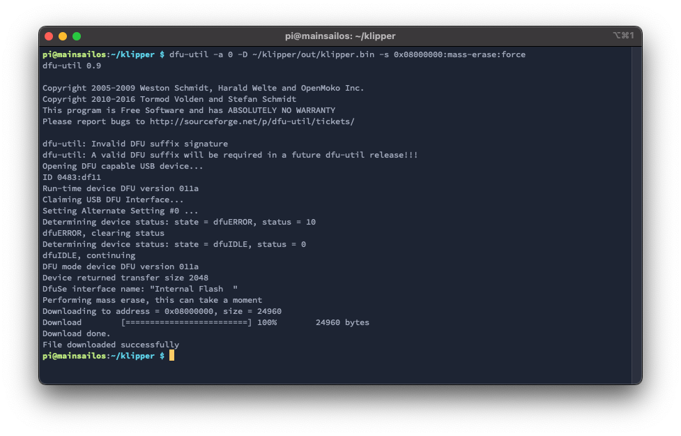
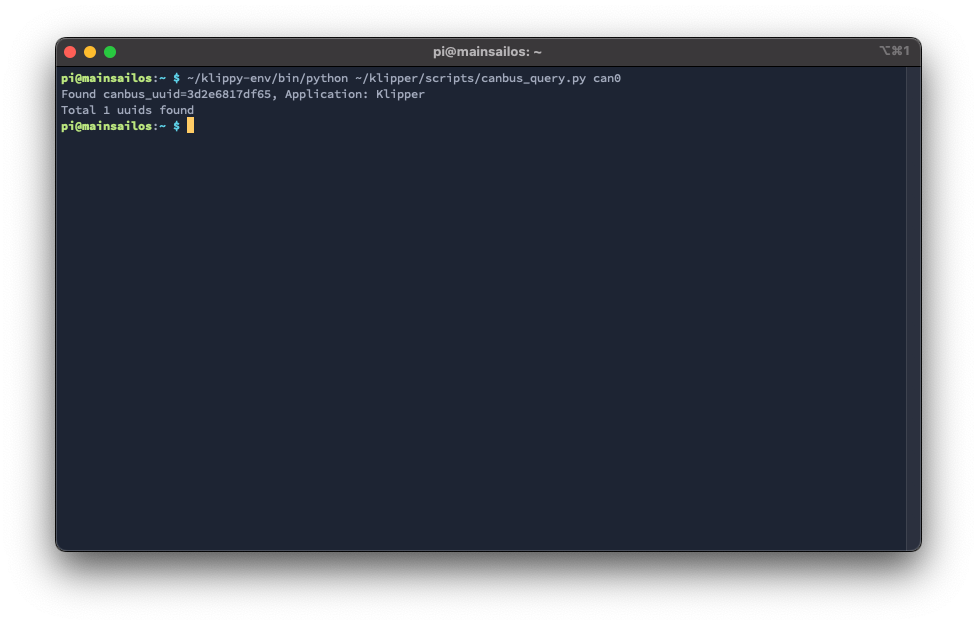

# Klipper Firmware for Mellow Fly-SHT 36/42 v1
The BigTreeTech EBB series is a toolhead board series that can communicate via CAN. This guide explains which settings
you need, to flash your EBB boards with Klipper.

!!! success "This guide is tested with the following boards:"

    - Mellow Fly-SHT 42 v1

    This guide was verified on a Pi running [MainsailOS](https://github.com/mainsail-crew/MainsailOS){:target="_blank"}

## Configure Klipper firmware
Open the config interface of the Klipper firmware with following commands:
``` bash
cd ~/klipper
make menuconfig
```
and set the following settings:

- Enable extra low-level configuration options: **check**
- Micro-controller Architecture: **STMicroelectronics STM32**
- Processor model: **STM32F072**
- Bootloader offset: **No bootloader** *(without CanBoot)*
- Bootloader offset: **8KiB bootloader** *(with CanBoot)*
- Clock Reference: **8 MHz crystal**
- Communication interface: **CAN bus (on PB8/PB9)**
- CAN bus speed: **500000**


use `q` for exit and `y` for save these settings.

Now clear the cache and compile the Klipper firmware:
``` bash
make clean
make
```

## Flash Klipper
There are two ways to flash the Klipper firmware to the EBB.

- [Flash the firmware via USB](#flash-klipper-via-usb) 
- [Flash the firmware via CAN](#flash-klipper-via-can) (recommended) (only with CanBoot)

### Flash Klipper via USB
This is the classic way to flash the firmware to the Fly-SHT.

First, you have to put the board into DFU mode. To do this, plug in a jumper to the following pins and then plug in the
usb cable:


With the command `dfu-util -l`, you can check if the board is in DFU mode. If dfu-util can discover a board in DFU mode
it should then look like this:

If this is not the case, repeat the boot/restart process and test it again.

If your board is in DFU mode, you can flash Klipper with the following command:
``` bash
dfu-util -a 0 -D ~/klipper/out/klipper.bin -s 0x08000000:mass-erase:force
```

Now remove the jumper and unplug & plug-in the USB cable again.

### Flash Klipper via CAN
This is the recommended way to flash the firmware, when you use CanBoot on your board.

Find the UUID of your board:
``` bash
python3 ~/CanBoot/scripts/flash_can.py -i can0 -q
```
The output should look like this:


With the UUID you have just read, you can now flash the board with:
``` bash
python3 ~/CanBoot/scripts/flash_can.py -f ~/klipper/out/klipper.bin -i can0 -u <uuid>
```


## Add the MCU in Klipper
Finally, you can add the board to your Klipper `printer.cfg` with its UUID:
``` yaml title="printer.cfg"
[mcu SHT]
canbus_uuid: <uuid>

# embedded temperature sensor
[temperature_sensor SHT]
sensor_type: temperature_mcu
sensor_mcu: SHT
min_temp: 0
max_temp: 100
```

If you don't know the UUID of your SHT, you can read it out with the following command:
``` bash
~/klippy-env/bin/python ~/klipper/scripts/canbus_query.py can0
```
The output should look like this:
