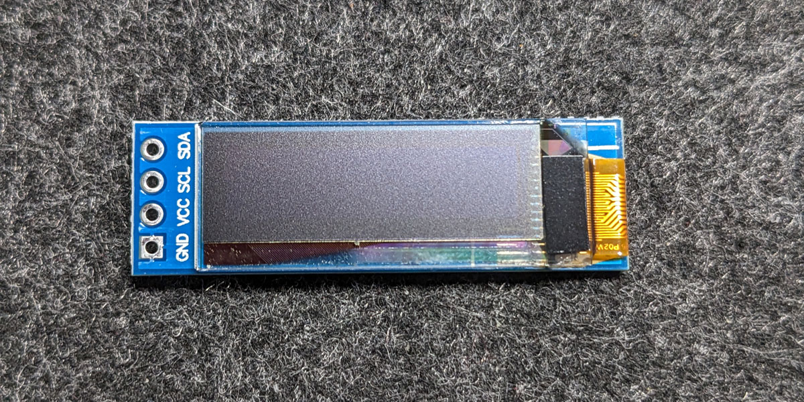

# Klipper with SSD1306 Display

The SSD1306 is a small display that can be used to display information from Klipper. The display is connected via I2C to
the SBC or the MCU. The display has a resolution of 128x64 pixels and is available in different colors.

Because the display can be used with different SBCs or MCUs/boards, i have worked out several instructions:

- [Raspberry Pi with Host MCU](rpi-host-mcu.md)