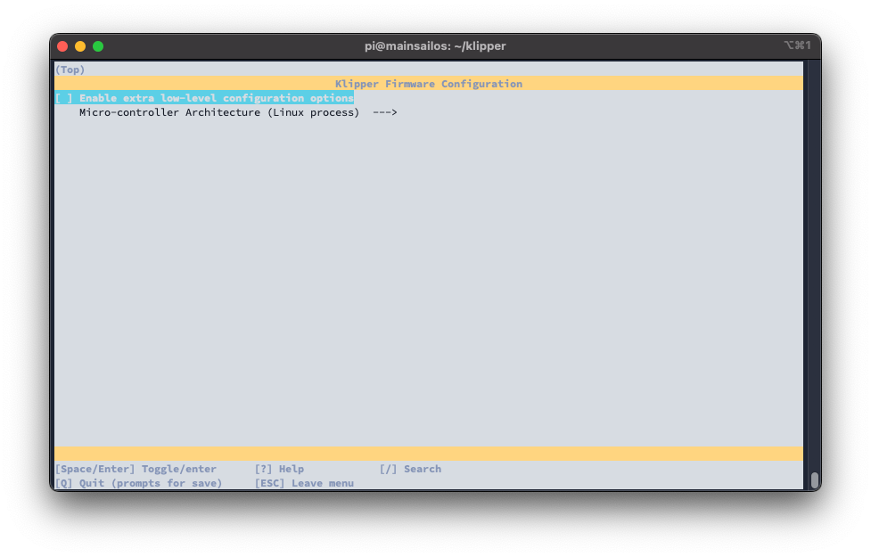
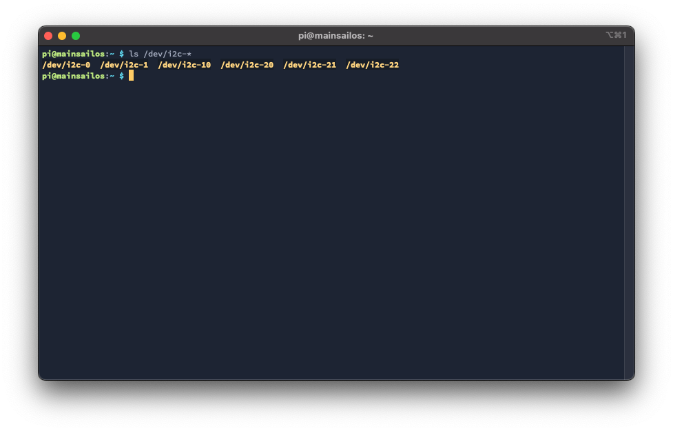
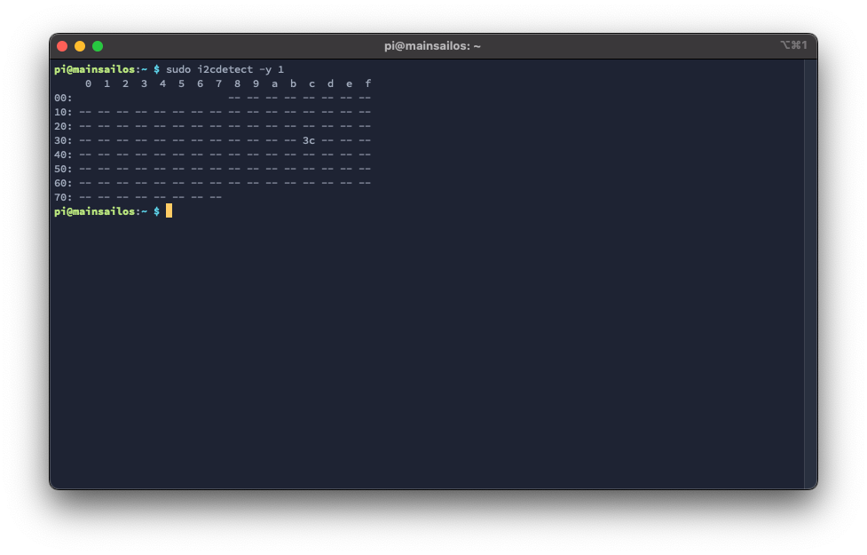
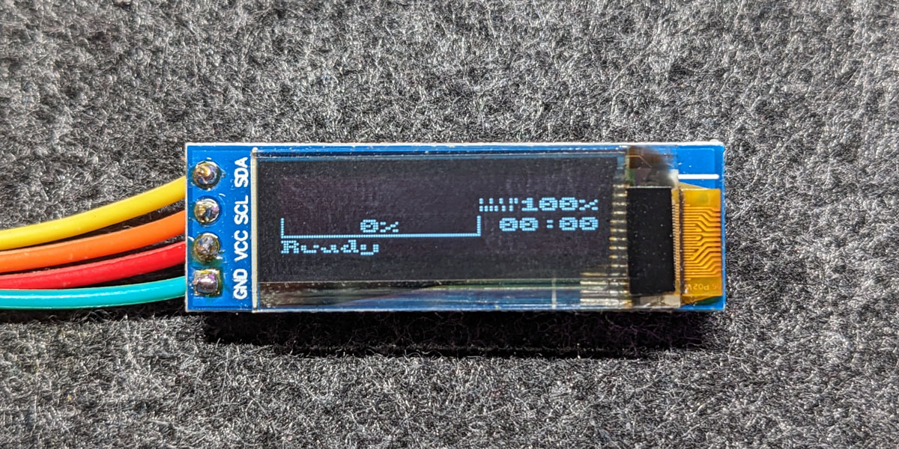

# SSD1306 connected to Raspberry Pi with Host MCU

This guide describes how to connect a SSD1306 display to a Raspberry Pi and install a Klipper Host MCU to use the
Display.

## Install Klipper Host MCU

At first, you have to install the service for the Klipper Host MCU. To do this, you have to execute the following
commands:

```bash
cd ~/klipper/
sudo cp ./scripts/klipper-mcu.service /etc/systemd/system/
sudo systemctl enable klipper-mcu.service
```

After that, you have to "flash" the Klipper Host MCU to the Raspberry Pi. To open the Klipper Firmware configuration:

```bash
cd ~/klipper/
make menuconfig
```

In the menu, you have to select the following options:

- Enable extra low-level configuration options: **uncheck**
- Microcontroller Architecture: **Linux process**

The result should look like this:

use `q` for exit and `y` for save these settings.

Now clear the cache and compile the Klipper firmware:
``` bash
make clean
make
```

To flash the Klipper Host MCU to the Raspberry Pi, you have to execute the following commands:

```bash
# stop klipper service
sudo systemctl stop klipper

# flash klipper-mcu
make flash

# start klipper-mcu service
sudo systemctl start klipper-mcu

# start klipper service
sudo systemctl start klipper
```

Now, Klipper Host MCU is installed and running on your Raspberry Pi. To add it to your Klipper configuration, you have
to add the following lines to your `printer.cfg`:

``` yaml
[mcu host]
serial: /tmp/klipper_host_mcu
```

and restart Klipper.

!!! warning "Permission denied error in klippy.log"

    If you get the error "Permission denied" in the klippy.log, you have to add your user to the dialout group:

    ```bash
    sudo usermod -a -G tty pi
    ```

## Enable I2C on Raspberry Pi

To enable the I2C interface on the Raspberry Pi, you have to execute the following commands:

```bash
echo "dtparam=i2c_arm=on" | sudo tee -a /boot/config.txt
echo "i2c-dev" | sudo tee -a /etc/modules
```

To activate the changes, you have to reboot the Raspberry Pi with `sudo reboot`.

After the reboot, you can check if the I2C interface is enabled with the following command:

```bash
ls /dev/i2c-*
```

This should look like:



## Connect SSD1306 to RPi

Connect the SSD1306 display to the Raspberry Pi with the following pins:

- VCC -> 3.3V (Pin 1)
- GND -> GND (Pin 6)
- SCL -> SCL (Pin 5)
- SDA -> SDA (Pin 3)

To check if the connection is working, you have to install the `i2cdetect` tool with:

```bash
sudo apt install i2c-tools
```

and then you can use the following command to test the connection:

```bash
sudo i2cdetect -y 1
```

This should look like:

Important is the `3c` in the output. This is the address of the SSD1306 display.

## Add SSD1306 to Klipper configuration

To add the SSD1306 display to your Klipper configuration, you have to add the following lines to your `printer.cfg`:

``` yaml
[display]
lcd_type: ssd1306
i2c_mcu: host
i2c_bus: i2c.1
```

and restart Klipper.

The result should look like this:


(Yes, this looks not very nice, but it works. If you have a better screen layout for Klipper, please let me know.)